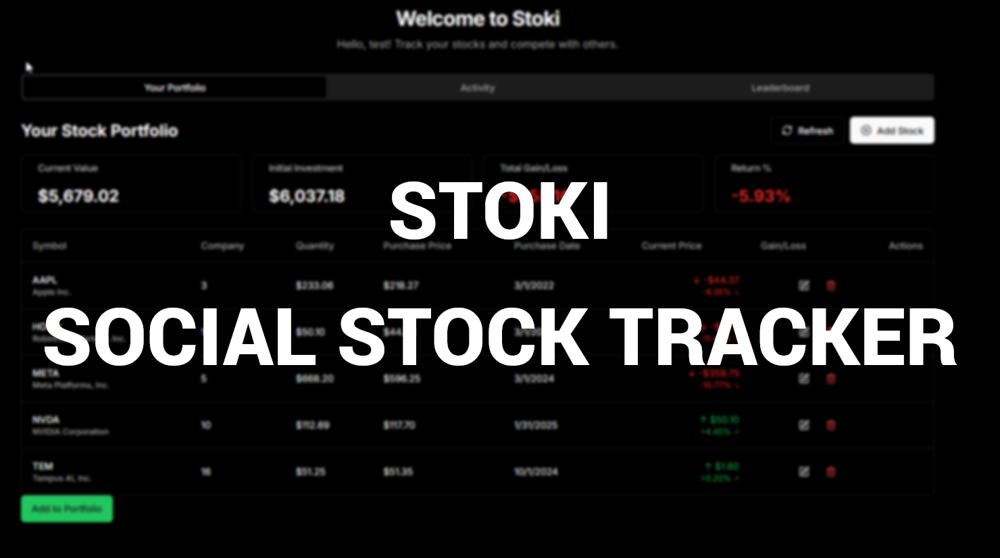

# Stoki - Social Stock Trading App

A modern social stock trading application that allows users to track their portfolios and compete with others. Built with Next.js 14, React.js, Shadcn UI, and Tailwind CSS.



## Table of Contents

- [Features](#features)
- [Tech Stack](#tech-stack)
- [Project Structure](#project-structure)
  - [App Directory](#app-directory)
  - [Components](#components)
  - [UI Components](#ui-components)
  - [Library Functions](#library-functions)
  - [API Routes](#api-routes)
- [Database Structure](#database-structure)
- [Getting Started](#getting-started)
- [Environment Variables](#environment-variables)
- [Deployment](#deployment)

## Features

- **User Authentication**: Simple username-based login system with avatar support
- **Portfolio Management**: Track stocks with purchase details and real-time performance
- **Leaderboard**: Compete with other users based on portfolio performance
- **Social Features**: View and compare portfolios with other traders
- **Responsive Design**: Optimized for both desktop and mobile experiences
- **Real-time Data**: Stock prices updated in real-time via Yahoo Finance API
- **Redis Caching**: Efficient data caching to reduce API calls and improve performance

## Tech Stack

- **Framework**: Next.js 14 with App Router
- **Frontend**: React.js 18, TypeScript
- **Styling**: Tailwind CSS, Shadcn UI, Radix UI components
- **State Management**: Zustand, React Context
- **Data Fetching**: Server Actions, API Routes
- **Database**: Vercel Postgres/Neon Database
- **Caching**: Redis/Vercel KV
- **Data Visualization**: Recharts, Visx
- **Form Handling**: React Hook Form, Zod validation
- **API Integration**: Yahoo Finance API for real-time stock data

## Project Structure

```
stoki/
├── app/                      # Next.js 14 app directory (pages and layouts)
│   ├── api/                  # API routes for backend functionality
│   ├── login/                # Login page
│   ├── test-comparison/      # Stock comparison test page
│   ├── test-portfolio/       # Portfolio test page
│   ├── test/                 # Test page
│   ├── globals.css           # Global CSS styles
│   ├── layout.tsx            # Root layout component
│   └── page.tsx              # Homepage component
├── components/               # React components
│   ├── ui/                   # Shadcn UI components
│   ├── user-portfolio.tsx    # Portfolio display component
│   ├── mobile-portfolio.tsx  # Mobile-optimized portfolio view
│   ├── user-leaderboard.tsx  # Leaderboard component
│   ├── mobile-leaderboard.tsx # Mobile-optimized leaderboard
│   ├── user-profile.tsx      # User profile component
│   ├── user-comparison.tsx   # Portfolio comparison component
│   ├── add-stock-dialog.tsx  # Dialog for adding stocks
│   ├── edit-stock-dialog.tsx # Dialog for editing stocks
│   ├── login-modal.tsx       # Login modal component
│   ├── mobile-nav.tsx        # Mobile navigation component
│   ├── user-menu.tsx         # User menu component
│   ├── activity-feed.tsx     # Activity feed component
│   └── stock-add-form.tsx    # Form for adding stocks
├── lib/                      # Shared utility functions and hooks
│   ├── auth-context.tsx      # Authentication context provider
│   ├── db.ts                 # Database interaction functions
│   ├── redis.ts              # Redis caching functions
│   ├── hooks.tsx             # Custom React hooks
│   └── utils.ts              # Utility functions
├── public/                   # Static assets
├── scripts/                  # Utility scripts
├── prisma/                   # Prisma schema and migrations
└── migrations/               # Database migrations
```

### App Directory

The `app` directory follows Next.js 14's App Router structure:

- **page.tsx**: The main homepage that renders the portfolio and leaderboard components
- **layout.tsx**: The root layout that includes the authentication provider and theme setup
- **api/**: Backend API routes that handle data fetching and manipulation
- **login/**: Login page for user authentication
- **test-*** directories: Test pages for different features

### Components

The `components` directory contains React components used throughout the application:

- **user-portfolio.tsx**: Main component for displaying a user's stock portfolio with real-time values, gains/losses, and actions to add/edit/delete stocks
- **mobile-portfolio.tsx**: Mobile-optimized version of the portfolio view with adapted layout for smaller screens
- **user-leaderboard.tsx**: Displays rankings of users based on portfolio performance
- **mobile-leaderboard.tsx**: Mobile-optimized version of the leaderboard
- **user-profile.tsx**: Detailed user profile view with portfolio performance metrics and charts
- **user-comparison.tsx**: Allows comparing portfolios between different users
- **add-stock-dialog.tsx**: Dialog for adding new stocks to a portfolio with symbol search and validation
- **edit-stock-dialog.tsx**: Dialog for editing existing stock entries
- **login-modal.tsx**: Authentication modal for user login
- **mobile-nav.tsx**: Bottom navigation for mobile views
- **activity-feed.tsx**: Displays recent activity from users
- **stock-add-form.tsx**: Form component for adding stock details

### UI Components

The `components/ui` directory contains reusable UI components built with Shadcn UI and Radix Primitives:

- **button.tsx**: Button component with various styles and variants
- **card.tsx**: Card component for content containers
- **dialog.tsx**: Modal dialog component
- **dropdown-menu.tsx**: Dropdown menu component
- **form.tsx**: Form components with validation integration
- **input.tsx**: Input field component
- **select.tsx**: Select dropdown component
- **table.tsx**: Table component for data display
- **toast.tsx**: Toast notification component
- **tabs.tsx**: Tabbed interface component
- **avatar.tsx**: User avatar component
- **badge.tsx**: Badge component for labels and tags
- **progress.tsx**: Progress indicator component
- **skeleton.tsx**: Loading skeleton component
- **theme-toggle.tsx**: Dark/light theme toggle component

### Library Functions

The `lib` directory contains shared utility functions, hooks, and services:

- **auth-context.tsx**: Authentication context provider for user login state management
- **db.ts**: Database interaction functions for user data, stocks, and leaderboard
- **redis.ts**: Redis caching functions for performance optimization
- **hooks.tsx**: Custom React hooks (e.g., useIsMobile)
- **utils.ts**: Generic utility functions

### API Routes

The `app/api` directory contains backend API routes:

- **auth/**: User authentication endpoints
- **stocks/**: Stock data fetching and manipulation
- **portfolio/**: Portfolio management endpoints
- **leaderboard/**: Leaderboard data calculation and retrieval
- **user/**: User profile management
- **market-index/**: Market index data retrieval
- **transactions/**: Stock transaction history
- **upload/**: File upload handling for avatars
- **init-db/**: Database initialization
- **db-status/**: Database connection status checks
- **clear-cache/**: Cache clearing endpoints
- **debug/**: Debugging endpoints

## Database Structure

The application uses a PostgreSQL database with the following main tables:

- **users**: Stores user information (id, username, avatar)
- **user_stocks**: Stores stock holdings for each user (user_id, symbol, company_name, quantity, purchase_price, purchase_date)

## Getting Started

First, install the dependencies:

```bash
npm install
# or
yarn install
# or
pnpm install
```

Then, run the development server:

```bash
npm run dev
# or
yarn dev
# or
pnpm dev
```

Open [http://localhost:3000](http://localhost:3000) with your browser to see the result.

## Database Setup

1. Create a new Postgres database in the Vercel dashboard:
   - Log in to your Vercel account and go to your project
   - Navigate to the "Storage" tab
   - Select "Create New" and choose "Postgres"
   - Follow the prompts to create a new database

2. Configure your local environment:
   - In your Vercel project, go to the "Storage" tab, select your database
   - Find your connection strings in the "Quickstart" tab
   - Copy these values to your local `.env.local` file

3. Initialize the database:
   - Run the initialization script to create the necessary tables:
   ```bash
   npm run dev
   ```
   - Visit `/api/init-db` in your browser to run the database initialization

## Environment Variables

Your `.env.local` file should include the following variables:

```
# Vercel Postgres or Neon database URL
DATABASE_URL=your_database_connection_string

# Alternatively, these variables are supported
POSTGRES_URL=your_postgres_connection_string
POSTGRES_URL_NON_POOLING=your_postgres_non_pooling_connection_string

# Redis connection (optional)
REDIS_URL=your_redis_connection_string
```

## Deployment

This project is designed to be deployed on Vercel. Push your repository to GitHub and import it to Vercel for automatic deployment.

## License

[MIT](LICENSE) 